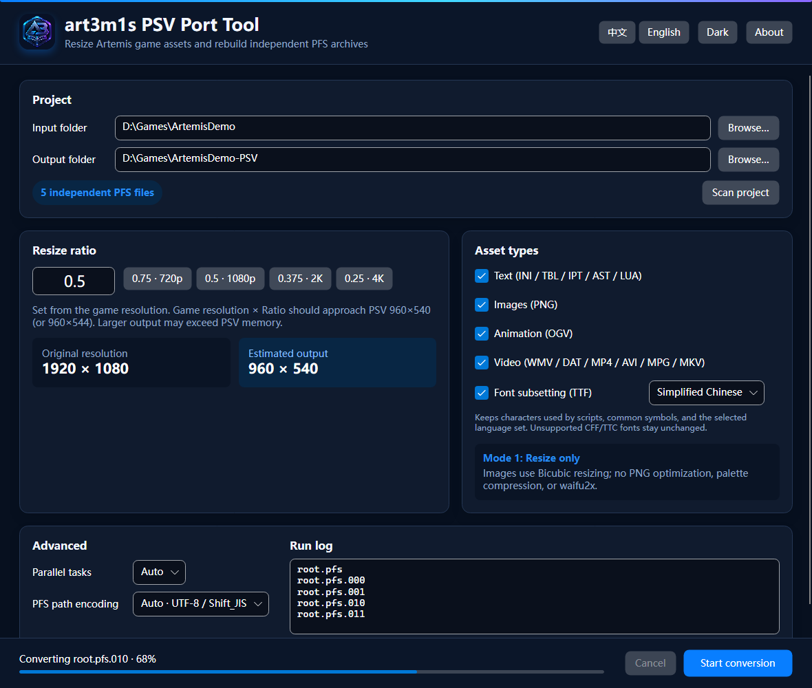

# art3m1s_psv_port_tool

[简体中文](README.md) · [English](README.en.md)

[](https://github.com/DeQxJ00/art3m1s_psv_port_tool/actions/workflows/ci.yml)
[](https://github.com/DeQxJ00/art3m1s_psv_port_tool/actions/workflows/release.yml)

A PSV porting assistant for Artemis-engine games. It extracts each physical PFS independently, resizes selected assets, and rebuilds it under the exact same file name. Arbitrarily named loose directories under the game root are copied recursively and their assets are converted by file extension (tested at three levels and with no depth limit in the implementation). The app uses .NET 10, Avalonia 12, C# 14, and NativeAOT on Windows, Linux, and macOS.

> Only process game assets you are authorized to modify, and keep a backup. This tool does not bypass platform signing, licensing encryption, or DRM.

## UI screenshots



[中文深色](docs/screenshots/ui-zh-CN-dark.png) · [English dark](docs/screenshots/ui-en-US-dark.png) · [中文浅色](docs/screenshots/ui-zh-CN-light.png) · [English light](docs/screenshots/ui-en-US-light.png)

## Downloads and platform support

Releases provide NativeAOT single files for `win-x64` and `linux-x64`, plus unsigned and unnotarized `.app.zip` bundles for `osx-x64` and `osx-arm64`. macOS may require manual approval under Privacy & Security. FFmpeg/ffprobe 9.0.1 GPL Full executables are shipped in the release package's `tools` directory and are not embedded in the main application. The build includes x264, libtheora, libogg, and zlib, with no nonfree components. Development builds may use `ART3M1S_FFMPEG` and `ART3M1S_FFPROBE`.

## Usage

1. Select a game root containing `xxxxx.pfs` and a different output directory.
2. Scan and verify the independent PFS count and detected resolution.
3. Set Ratio and select Text, Images, Animation, and Video.
4. Start conversion. If output exists, click Start once more to confirm replacement.

The converter writes to a dedicated sibling staging directory and replaces the destination only after every operation succeeds. Cancellation or failure removes temporary output.

## Ratio and PSV resolution guidance

The default is `0.5`; valid input is `0 < Ratio ≤ 1`. Presets are `0.75 · 720p`, `0.5 · 1080p`, `0.375 · 2K`, and `0.25 · 4K`. Aim for “game resolution × Ratio” near PSV `960×540` (or `960×544`). Larger images can exhaust PSV memory. Resolution is read from `[WINDOWS]` in root `system.ini`; otherwise inspect a PNG under extracted `image/bg`.

## Asset processing rules

- Text: exactly reproduces VisualNovelUpscaler's Artemis matching, truncation, encoding, and output behavior for INI / TBL / IPT / AST / LUA. IET is copied unchanged.
- Images: high-quality alpha-premultiplied ImageSharp Bicubic PNG resize only. No PNG optimization, palette compression, waifu2x, or lossy compression.
- Animation: Bicubic OGV resize through FFmpeg; each target dimension is truncated as `int(original dimension × Ratio)`, matching VisualNovelUpscaler, while frame rate and audio are retained.
- Video: DAT entries inside PFS archives may contain ordinary data such as font caches, so they always retain their original name and bytes and are never probed or converted. Loose WMV / DAT / MP4 / AVI / MPG / MKV videos outside PFS are all emitted as same-stem MP4 files using H.264 Main@3.1 and AAC. DAT video uses a fixed 960×544 output; other containers use Ratio-based dimension truncation. DAT files without a detectable video stream remain unchanged.
- Fonts (optional): trims TrueType `glyf` outlines to common Simplified Chinese, Japanese, or Traditional Chinese sets while always retaining characters actually used by scripts, ASCII, common punctuation, and full/half-width symbols. Composite dependencies are retained recursively. CFF/CFF2, TTC, and variable fonts remain unchanged for safety.
- Unselected asset types are copied byte-for-byte.

Default parallelism is `max(1, logical CPU count - 1)`, with at most two simultaneous video jobs.

## PNG palette and transparency guarantees

RGB24 stays RGB24 without Alpha; RGBA, grayscale, and transparent grayscale retain their color type. Indexed PNGs keep their original 1/2/4/8-bit depth. Original `PLTE` and `tRNS` chunks are written back byte-for-byte—the built-in palette is never edited, reordered, or reduced. Bicubic pixels are mapped back to the original palette and only pixel indices change. PNG coordinate text is scaled; every other PNG chunk is retained byte-for-byte apart from dimensions and image data.

## Build, tests, and GitHub Actions

.NET SDK 10.0.303 is required:

```powershell
dotnet restore art3m1s_psv_port_tool.slnx
dotnet test art3m1s_psv_port_tool.slnx -c Release
dotnet publish src/Art3m1s.PsvTool.App -c Release -r win-x64
./scripts/generate-screenshots.ps1
```

`ci.yml` checks Release builds, tests, formatting, screenshot baselines, and multi-platform NativeAOT. `release.yml` builds four targets for `v*` tags or manual runs, then publishes checksums, SBOM, licenses, and FFmpeg build/source information.

## Known limitations

- The first macOS release is unsigned and unnotarized.
- Unsupported video container/codec combinations stop with the original FFmpeg diagnostic instead of silently degrading.
- pf2/pf6 can be read, while rebuilt files are pf8. Individual PFS entries over 4 GiB are unsupported.
- Automatic text rules target common Artemis scripts; verify subtitles, hit areas, and animation coordinates in the actual game.

## Credits

Thanks to the following open-source projects.

| Project | License | Use in this project | Source |
|---|---|---|---|
| **pfs_upk** | GPL-3.0 | Reference for pf2 / pf6 / pf8 formats and pack/unpack behavior | [nextgal/pfs_upk@abdffcb](https://github.com/nextgal/pfs_upk/tree/abdffcbeb3c733ce234aa99ed42b206d13aaed2f) |
| **VisualNovelUpscaler** | MIT | Reference for Artemis text coordinates, sizes, and Ratio rules | [hokejyo/VisualNovelUpscaler@d755913](https://github.com/hokejyo/VisualNovelUpscaler/tree/d755913eb72f739ad4faea70e689cf933ba54c7f) |
| **Avalonia** | MIT | Cross-platform desktop UI (12.1.2) | [AvaloniaUI/Avalonia](https://github.com/AvaloniaUI/Avalonia) |
| **SixLabors.ImageSharp** | Six Labors Split License 1.0 | PNG decoding and Bicubic resizing (3.1.12) | [SixLabors/ImageSharp](https://github.com/SixLabors/ImageSharp) |
| **Optris.StaticGraphics.Avalonia.Software** | MIT fork and upstream component licenses | Static Skia / HarfBuzz graphics backend for NativeAOT | [NuGet](https://www.nuget.org/packages/Optris.StaticGraphics.Avalonia.Software) |
| **FFmpeg / ffprobe** | GPL-2.0-or-later Full build | Animation/video probing, resizing, and transcoding (9.0.1) | [FFmpeg 9.0.1 source](https://ffmpeg.org/releases/ffmpeg-9.0.1.tar.xz) |
| **x264** | GPL-2.0 | H.264 encoding | [VideoLAN/x264](https://code.videolan.org/videolan/x264) |
| **libtheora** | BSD-3-Clause | Theora encoding | [Xiph.Org/libtheora](https://github.com/xiph/theora) |
| **libogg** | BSD-3-Clause | Ogg container | [Xiph.Org/libogg](https://github.com/xiph/ogg) |
| **zlib** | Zlib | PNG frame-sequence compression | [zlib](https://zlib.net/) |
