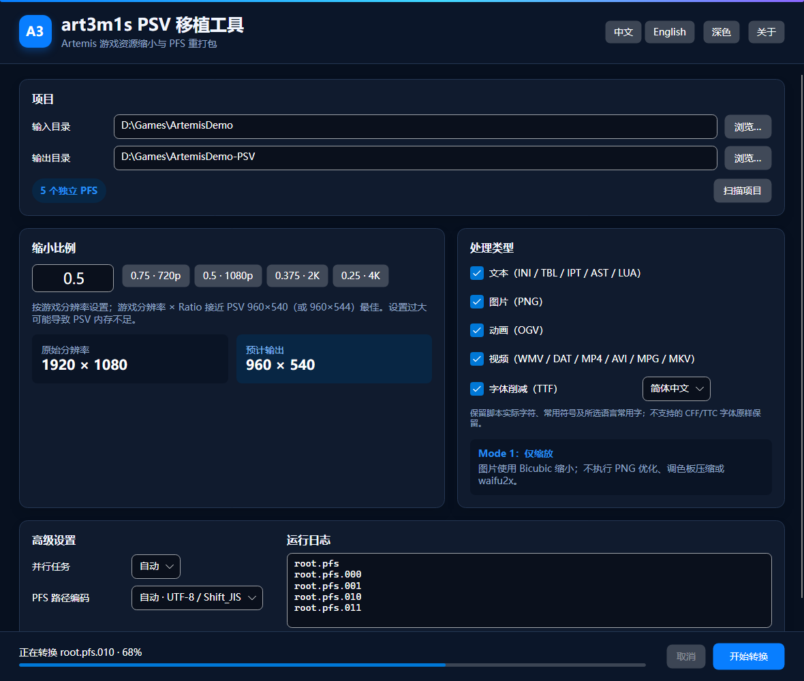

# art3m1s_psv_port_tool

[简体中文](README.md) · [English](README.en.md)

[](https://github.com/DeQxJ00/art3m1s_psv_port_tool/actions/workflows/ci.yml)
[](https://github.com/DeQxJ00/art3m1s_psv_port_tool/actions/workflows/release.yml)

面向 Artemis 引擎游戏的 PSV 移植辅助工具。它逐个解包物理 PFS、按选择缩小资源，再以相同文件名重新打包；PFS 之外的文件与目录也会复制到输出项目。应用使用 .NET 10、Avalonia 12、C# 14 与 NativeAOT，支持 Windows、Linux 和 macOS。

> 请只处理你有权修改的游戏资源，并先备份原项目。工具不绕过平台签名、加密授权或 DRM。

## UI 截图



[中文深色](docs/screenshots/ui-zh-CN-dark.png) · [English dark](docs/screenshots/ui-en-US-dark.png) · [中文浅色](docs/screenshots/ui-zh-CN-light.png) · [English light](docs/screenshots/ui-en-US-light.png)

## 下载与平台支持

Release 提供 `win-x64`、`linux-x64` NativeAOT 单文件，以及未签名、未公证的 `osx-x64` / `osx-arm64` `.app.zip`。macOS 首次启动可能需要在“隐私与安全性”中手动允许。FFmpeg/ffprobe 9.0.1 LGPL 可执行文件位于发行包的 `tools` 目录，不嵌入主程序；开发构建也可通过 `ART3M1S_FFMPEG` 与 `ART3M1S_FFPROBE` 指定工具。

## 使用步骤

1. 选择包含 `xxxxx.pfs` 的游戏根目录与不同的输出目录。
2. 扫描并确认独立 PFS 数量及检测到的分辨率。
3. 设置 Ratio，勾选文本、图片、动画和视频类型。
4. 开始转换；输出目录已存在时需要再次点击确认覆盖。

转换先写入输出目录同级的专用临时目录，全部成功后再替换目标；取消或失败会清理临时结果。

## Ratio 与 PSV 分辨率建议

默认 `0.5`，允许输入 `0 < Ratio ≤ 1`。参考按钮为 `0.75 · 720p`、`0.5 · 1080p`、`0.375 · 2K`、`0.25 · 4K`。以“原游戏分辨率 × Ratio”接近 PSV 的 `960×540`（或 `960×544`）为宜；设置过大会增加显存和内存压力。分辨率从根目录 `system.ini` 的 `[WINDOWS]` 读取；无法读取时可参考解包后的 `image/bg` PNG。

## 资源处理规则

- 文本：INI / TBL / IPT / AST / LUA 的 Artemis 坐标、尺寸与字号按 Ratio 缩放，保留 UTF-8 / Shift_JIS、BOM 和换行；IET 原样复制。
- 图片：PNG 使用 ImageSharp Bicubic，仅缩放，不进行 PNG 优化、调色板压缩、waifu2x 或有损压缩。
- 动画：OGV 使用 FFmpeg Bicubic，保持帧率与音频。
- 视频：WMV / DAT / MP4 / AVI / MPG / MKV 尽量保持原视频编码并复制音频；WMV3 转为 WMV2。
- 字体（可选）：对 TrueType `glyf` 字体按简体中文、日文或繁体中文常用范围削减轮廓，同时始终保留脚本中实际出现的字符、ASCII、常用标点与全角/半角符号；复合字形依赖会递归保留。CFF/CFF2、TTC 与可变字体为避免损坏会原样保留。
- 未勾选类型按字节复制，不执行转换。

并行度默认为 `max(1, CPU 逻辑核心数 - 1)`，视频任务最多同时两个。

## PNG 颜色表与透明度保证

RGB24 输出仍为 RGB24，不增加 Alpha；RGBA、灰度、透明灰度保持颜色类型。索引色保持原 1/2/4/8-bit 位深，原 `PLTE` 与 `tRNS` 块逐字节写回，不修改、重排或删减自带颜色表。Bicubic 结果仅映射回原颜色表并重写像素索引。PNG 坐标文本按 Ratio 缩放，其他元数据尽量保留。

## 构建、测试和 GitHub Actions

需要 .NET SDK 10.0.303：

```powershell
dotnet restore art3m1s_psv_port_tool.slnx
dotnet test art3m1s_psv_port_tool.slnx -c Release
dotnet publish src/Art3m1s.PsvTool.App -c Release -r win-x64
./scripts/generate-screenshots.ps1
```

`ci.yml` 执行 Release 编译、测试、格式、截图基线与多平台 NativeAOT 检查；`release.yml` 在 `v*` 标签或手动触发时构建四个平台并发布校验和、SBOM、许可与 FFmpeg 构建信息。

## 已知限制

- macOS 首版不签名、不公证。
- 无法由容器和原编码支持的音视频流会报告 FFmpeg 原始诊断并停止，不会静默降级。
- pf2/pf6 可读取，但重新打包统一输出 pf8；超 4 GiB 的单个 PFS 条目不支持。
- 自动文本规则面向常见 Artemis 脚本，发布前仍应在真实游戏中检查字幕、点击区域与动画坐标。

## Credits

感谢以下开源项目。

| 项目 | 许可证 | 在本项目中的用途 | 来源 |
|---|---|---|---|
| **pfs_upk** | GPL-3.0 | pf2 / pf6 / pf8 格式及打包、解包行为参考 | [nextgal/pfs_upk@abdffcb](https://github.com/nextgal/pfs_upk/tree/abdffcbeb3c733ce234aa99ed42b206d13aaed2f) |
| **VisualNovelUpscaler** | MIT | Artemis 文本坐标、尺寸与 Ratio 处理规则参考； | [hokejyo/VisualNovelUpscaler@d755913](https://github.com/hokejyo/VisualNovelUpscaler/tree/d755913eb72f739ad4faea70e689cf933ba54c7f) |
| **Avalonia** | MIT | 跨平台桌面 UI（12.1.2） | [AvaloniaUI/Avalonia](https://github.com/AvaloniaUI/Avalonia) |
| **SixLabors.ImageSharp** | Six Labors Split License 1.0 | PNG 解码与 Bicubic 缩放（3.1.12） | [SixLabors/ImageSharp](https://github.com/SixLabors/ImageSharp) |
| **Optris.StaticGraphics.Avalonia.Software** | MIT fork 及上游组件许可证 | NativeAOT 静态 Skia / HarfBuzz 图形后端 | [NuGet](https://www.nuget.org/packages/Optris.StaticGraphics.Avalonia.Software) |
| **FFmpeg / ffprobe** | LGPL-2.1-or-later 构建 | 动画与视频探测、缩放及转码（9.0.1） | [FFmpeg 9.0.1 源码](https://ffmpeg.org/releases/ffmpeg-9.0.1.tar.xz) |
